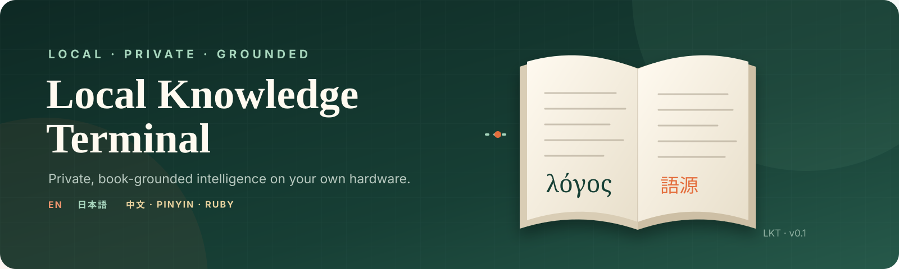

[](docs/assets/banner.svg)

# Local Knowledge Terminal

**Private, book-grounded intelligence on your own hardware.**

[](https://www.python.org/)
[](https://huggingface.co/Qwen/Qwen3-4B-GGUF)
[](https://github.com/ggml-org/llama.cpp)
[](https://www.raspberrypi.com/products/raspberry-pi-5/)
[](https://github.com/sponsors/lachlanchen)

Local Knowledge Terminal (LKT) turns a private book collection into cited,
multilingual cards. Its first library combines structured editions of **Word
Origins**, **The Book of Answers**, and **The Book of Questions**. Qwen3-4B
Q4_K_M runs locally on an 8 GB Raspberry Pi 5; retrieval, inference, history,
and the browser GUI operate without a cloud API.

## Four experiences, one card contract

- **Word Origin** finds the strongest dictionary entry, explains the historical
  path, and creates English, Japanese, and Chinese memory views with Japanese
  reading/ruby and Chinese pinyin.
- **Word Card** retrieves several relevant Word Origins entries and composes a
  compact, evidence-bound explanation.
- **Book Answer** makes a reproducible draw from 318 reviewed cards, preserves
  the published answer translations, and adds a reflective note.
- **Book Question** searches 291 reviewed questions by theme and falls back to a
  reproducible draw when no lexical match exists.

All four modes produce the same versioned card JSON. Japanese card-book text
retains token-level furigana; Chinese views add tone-marked pinyin. The web GUI
renders that JSON today; e-ink and audio adapters will consume it later without
changing corpus, retrieval, or model code.

```text
 Word Origins ──► exact + lexical retrieval ──┐
Book Answers ──► reproducible cited draw ─────┼──► evidence
Book Questions ─► lexical search / draw ──────┘       │
                                                       ▼
                                             Qwen3-4B on llama.cpp
                                                       │
                                      ┌────────────────┴───────────────┐
                                      ▼                                ▼
                              versioned card JSON            deterministic citations
                                      │
                            ┌─────────┼─────────┐
                            ▼         ▼         ▼
                          Web GUI   E-ink     Audio
                          (ready)  (adapter)  (adapter)
```

## Grounding rule

The language model writes explanations and missing language aids, but it never
writes the citation list. LKT attaches entry IDs, excerpts, sections, page
numbers, digital locators, and reviewed card-book translations directly from
retrieval records. If the configured book has no evidence, the app does not
generate a card.

## Repository map

| Path | Responsibility |
| --- | --- |
| `lkt/corpus.py` | Word Origins ingestion, atomic SQLite index, exact + FTS retrieval |
| `lkt/card_books.py` | Multilingual Answer/Question ingestion, search, and deterministic draws |
| `lkt/llm.py` | Small OpenAI-compatible llama.cpp adapter and strict JSON prompt |
| `lkt/service.py` | Card composition and normalization |
| `lkt/store.py` | Local card history |
| `lkt/web.py` | Dependency-free HTTP API and GUI server |
| `lkt/outputs.py` | Stable web/e-ink/audio output boundary |
| `lkt/static/` | Desktop-class GUI, responsive enough for later kiosk use |
| `scripts/` | Reproducible Pi runtime, install, update, and smoke-test tools |
| `systemd/` | Hardened model and application services |
| `docs/lineage.md` | Exact legacy-project and corpus provenance |

## Local development

LKT's core has no third-party Python runtime dependency:

```powershell
cd C:\Users\Administrator\Projects\LocalKnowledge
python -m unittest discover -s tests -v
python -m compileall -q lkt tests
```

Build a local index from the structured book export:

```powershell
$env:LKT_DATA_DIR="$PWD\var"
python -m lkt.cli ingest "C:\path\to\word-origins-pdf2tex\json\entries.jsonl"
python -m lkt.cli ingest-card-book answer "C:\path\to\book-of-answers\json\multilingual-items.jsonl"
python -m lkt.cli ingest-card-book question "C:\path\to\book-of-questions\json\multilingual-items.jsonl"
python -m lkt.cli search abacus
python -m lkt.cli search technology --corpus question
```

With a llama.cpp server listening on port 8081:

```powershell
python -m lkt.cli generate abacus --mode word
python -m lkt.cli generate "Should I begin?" --mode answer
python -m lkt.cli generate technology --mode question
python -m lkt.cli serve
```

Open <http://127.0.0.1:8090>.

## Raspberry Pi 5 layout

```text
/home/lachlan/LocalKnowledgeTerminal/
├── source/      # this Git repository; updated with fetch + fast-forward pull
├── runtime/     # pinned llama.cpp checkout and ARM64 build
├── models/      # Qwen GGUF (not committed)
├── data/        # corpus index and saved cards (not committed)
└── logs/        # bootstrap logs (not committed)
```

Pinned runtime artifacts:

| Artifact | Revision | Integrity |
| --- | --- | --- |
| llama.cpp | `v0.3.0` / `c1d0e7a004015f23bc0233470b747b596f29b264` | Commit-pinned source archive |
| Qwen3-4B-GGUF | `bc640142c66e1fdd12af0bd68f40445458f3869b` | Q4_K_M SHA-256 `7485fe6f…534fdf5` |
| Model file | `Qwen3-4B-Q4_K_M.gguf` | 2,497,280,256 bytes |

On the Pi:

```bash
./scripts/bootstrap_runtime.sh
sudo ./scripts/install_pi.sh \
  /path/to/entries.jsonl \
  /path/to/answers/multilingual-items.jsonl \
  /path/to/questions/multilingual-items.jsonl
./scripts/smoke_test.sh
```

For later Windows → GitHub → Pi development:

```bash
cd /home/lachlan/LocalKnowledgeTerminal/source
./scripts/update_pi.sh
```

Then open `http://127.0.0.1:8090` in the Pi's VNC desktop, or
`http://<pi-lan-address>:8090` from the trusted local network.

## Data and copyright

The book PDFs, extracted corpora, model weights, generated indexes, and saved
cards are deliberately excluded from Git. Provide a legally obtained local
JSONL export during installation. LKT records each SHA-256 in its SQLite index
so a generated card can be traced to the exact corpus build. See
[`docs/corpora.md`](docs/corpora.md) for the verified reference set.

## Lineage

LKT is a clean, local-first successor informed by
[`WordsCardEink`](https://github.com/lachlanchen/WordsCardEink) and
[`WordOrigins`](https://github.com/lachlanchen/WordOrigins). It does not import
their monolithic runtime or hardware dependencies. See
[`docs/lineage.md`](docs/lineage.md) for pinned commits and retained ideas.

## Support

| Donate | PayPal | Stripe |
| --- | --- | --- |
| [](https://chat.lazying.art/donate) | [](https://paypal.me/RongzhouChen) | [](https://buy.stripe.com/aFadR8gIaflgfQV6T4fw400) |
