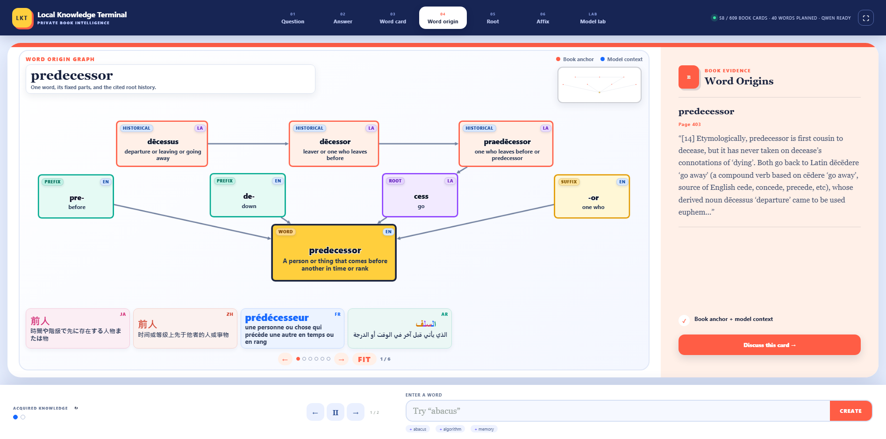
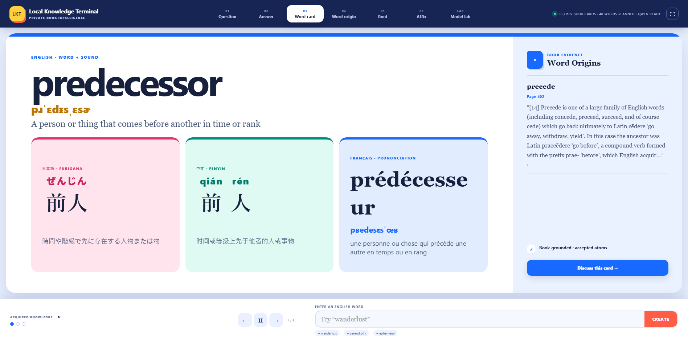

[English](../README.md) · [العربية](README.ar.md) · [Español](README.es.md) · [Français](README.fr.md) · [日本語](README.ja.md) · [한국어](README.ko.md) · [Tiếng Việt](README.vi.md) · [中文 (简体)](README.zh-Hans.md) · [中文（繁體）](README.zh-Hant.md) · [Deutsch](README.de.md) · [Русский](README.ru.md)

[](../docs/assets/banner.svg)

# Local Knowledge Terminal

**Tri thức riêng tư, dựa trên sách, chạy trên phần cứng của chính bạn.**

[](https://www.python.org/)
[](https://huggingface.co/Qwen/Qwen3-8B-GGUF)
[](https://github.com/ggml-org/llama.cpp)
[](https://www.raspberrypi.com/products/raspberry-pi-5/)
[](https://github.com/sponsors/lachlanchen)

Local Knowledge Terminal (LKT) biến một bộ sưu tập sách riêng tư thành những thẻ
đa ngôn ngữ có trích dẫn. Thư viện đầu tiên kết hợp các ấn bản có cấu trúc của
**Word Origins**, **The Book of Answers**, **The Book of Questions**, một
**English Root Dictionary** và một **English Affix Dictionary**. Qwen3-4B Q4_K_M
chạy cục bộ trên Raspberry Pi 5 8 GB; Qwen3-8B là cấu hình chậm hơn có thể chọn.
Truy xuất, suy luận, lịch sử và giao diện trình duyệt đều hoạt động không cần API đám mây.

## Thử với một bộ sưu tập

Nếu bạn đã có một bộ sưu tập sách hoặc từ điển riêng tư với phạm vi rõ ràng,
[đợt đánh giá độ phù hợp ban đầu trị giá 250 USD](https://lazying.art/lkt/) bắt đầu
bằng bước kiểm tra miễn phí. Phạm vi gồm một bộ sưu tập, một mục tiêu ngôn ngữ và
một máy sẵn có; sản phẩm bàn giao gồm bản đồ dữ liệu/quyền riêng tư/trích dẫn, một
mẫu đã thống nhất tối đa 12 đơn vị nguồn và 20 câu hỏi thử, tối đa hai thẻ trình
duyệt có trích dẫn nếu tư liệu dùng được, khuyến nghị nên hay không nên tiếp tục,
và một lượt sửa lỗi dữ kiện. Trước khi thanh toán, phạm vi bằng văn bản sẽ định
nghĩa đơn vị nguồn — chẳng hạn một đoạn, một bản ghi hoặc một trang đại diện.
Phần cứng, vận chuyển, OCR tùy chỉnh, chuyển đổi hàng loạt, triển khai sản xuất và
hỗ trợ liên tục không nằm trong phạm vi cố định này.

Để xem chính xác ba sản phẩm bàn giao trông như thế nào mà không chia sẻ tư liệu
khách hàng, hãy đọc [báo cáo mẫu về độ phù hợp của bộ sưu tập](../docs/sample-fit-report.md).
Báo cáo áp dụng định dạng đó cho bộ sưu tập tham chiếu do chính LKT lập tài liệu;
nó hoàn toàn không phải là kết quả khách hàng hay tuyên bố về một hợp đồng trả phí.

## Sáu trải nghiệm độc lập, một hợp đồng thẻ

- **Word Origin** dùng bộ truy xuất một mục và lời nhắc riêng để tạo đồ thị tổ tiên
  có hướng, tương tác được và có giới hạn. Các nhánh hình vị được giữ nguyên; nút
  được sách hỗ trợ và ngữ cảnh ngôn ngữ học do mô hình bổ sung được phân biệt rõ.
- **Word Card** truy xuất nhiều mục Word Origins liên quan và tạo một màn hình ghi
  nhớ đa ngôn ngữ gọn. Tiếng Anh, Nhật và Trung giữ cố định, còn tiếng Pháp và Ả Rập
  luân phiên trong bảng thứ tư.
- **Book Answer** rút thăm tái lập được từ 318 thẻ đã duyệt, giữ nguyên bản dịch câu
  trả lời đã xuất bản và bổ sung một ghi chú suy ngẫm.
- **Book Question** tìm trong 291 câu hỏi đã duyệt theo chủ đề và chuyển sang rút
  thăm tái lập được khi không có kết quả khớp từ vựng.
- **Root Graph** ưu tiên 4.018 bản ghi gốc từ có nội dung, sau đó là các mục phụ tố
  hỗ trợ khớp chính xác, rồi lưu một đồ thị họ từ đệ quy.
- **Affix Graph** đảo thứ tự ưu tiên giữa 5.179 bản ghi phụ tố có nội dung và Root
  Dictionary, đồng thời giữ một đồ thị đầy đủ cho từ trung tâm.

Mỗi chế độ có chính sách truy xuất và lời nhắc mô hình nghiêm ngặt riêng. Word Origin
và Word Card chủ ý dùng chung chỉ mục Word Origins nhưng trình bày khác nhau; Answer
và Question dùng sách và công cụ truy xuất riêng. Cả sáu chế độ tạo cùng một JSON thẻ
được quản lý phiên bản. Văn bản sách-thẻ tiếng Nhật giữ furigana ở cấp token, còn màn
hình tiếng Trung nhận pinyin đầy đủ dấu thanh một cách tất định. Giao diện web hiện
đang dựng JSON đó; về sau bộ điều hợp giấy điện tử và âm thanh sẽ dùng cùng dữ liệu mà
không đổi mã nguồn kho ngữ liệu, truy xuất hay mô hình.

Không gian **Chat / Benchmark** riêng trao đổi trực tiếp với Qwen và báo cáo thời gian
thực, token đầu vào/đầu ra và tốc độ sinh. Nó được đánh dấu rõ là đầu ra mô hình thô,
không có trích dẫn, và không bao giờ được lưu như một thẻ dựa trên sách. Các quan sát
được giữ trong bảng riêng của sổ cái tri thức cục bộ. Mỗi lần lặp lời nhắc vẫn chạy Qwen
lại; sổ cái là lịch sử chứ không phải bộ nhớ đệm. Từ bất kỳ thẻ nào, **Discuss this card**
mở Model Lab với thẻ đã lưu cùng đoạn trích truy xuất làm ngữ cảnh giới hạn.
Mỗi phiên Model Lab trực tiếp cũng có một luồng truy vấn bền vững. Các lượt tiếp theo
giữ quan hệ cha/con; cuộc thảo luận về thẻ liên kết đến nguyên tử nội dung nguồn đã
chuẩn hóa, còn phản hồi Qwen vẫn được ghi rõ là không có trích dẫn.

## Màn hình sản phẩm

Trình duyệt là sân khấu biên tập cho thẻ, không phải bảng điều khiển trò chuyện. Mỗi
slide hiển thị là một bố cục trọn màn hình không cuộn, với ý chính lớn và một trích dẫn
nguồn gọn. Word Origin dành phần giữa cho đồ thị có hướng Cytoscape.js. Word Card đặt
từ tiếng Anh/IPA lớn phía trên các bảng tiếng Nhật/Trung cố định và một bảng Pháp/Ả Rập
luân phiên. Answer và Question dùng băng chuyền ngôn ngữ bên trong — tiếng Anh, ruby
tiếng Nhật, ruby pinyin tiếng Trung — và chia câu quá dài thành các slide dễ đọc bổ sung.
Phân tích ngữ pháp cục bộ đã duyệt chỉ thêm màu vai trò nhẹ vào đúng văn bản đó, không
thêm chú giải hay siêu dữ liệu chật chội. Thẻ đã lưu tạo thành các băng chuyền ngoài độc
lập theo từng chế độ với nút trước/sau.
Root, Affix và Word Origin dùng chung một bộ dựng đồ thị Cytoscape: đồ thị đã lưu đầy đủ,
bản đồ tổng quan ở góc và các slide tiêu điểm phóng vào gốc, tiền tố, hậu tố hoặc nhánh
lịch sử mà không nhân đôi đồ thị. Chế độ toàn màn hình ẩn toàn bộ phần viền ứng dụng;
`/?display=1` mở cùng tài liệu thẻ như một bề mặt phù hợp với kiosk. CSS in và JSON thẻ
có phiên bản tạo ranh giới rõ ràng cho việc dựng trên giấy điện tử sau này.

### Màn hình trực tiếp trên Raspberry Pi

Word Origin có nút theo kích thước nội dung, đồ thị tổ tiên đầy đủ, bảng nghĩa đa ngôn
ngữ, slide nhánh và đặt lại vừa nhất bằng một lần nhấp.



Word Card giữ từ tiếng Anh và âm đọc làm trọng tâm, đồng thời trình bày các bảng tiếng
Nhật và Trung lớn, ổn định cạnh bảng Pháp/Ả Rập luân phiên.



Mỗi thẻ được sinh nhận một ID mới và ở lại trong sổ cái thẻ. Cơ sở dữ liệu chuẩn hóa
thứ hai `knowledge.sqlite3` lưu thuật ngữ, nghĩa, phát âm, đoạn âm vị/tự vị, hình vị,
lịch sử, bản dịch, ngữ pháp, nguồn gốc, bản sửa và dòng truy vấn đã duyệt dưới dạng các
nguyên tử tái sử dụng. Thẻ là các màn hình có thể dựng lại từ những nguyên tử đó. Đồ thị
thuộc tính LadybugDB là phép chiếu duyệt dẫn xuất và luôn có thể dựng lại từ SQLite.
Thẻ Book Answer và Book Question đã duyệt cũng đặt chính xác văn bản Anh, Nhật, Trung
đã rà soát trong kho chuẩn hóa này. Mỗi ngôn ngữ là một nguyên tử nội dung độc lập nối
với trích dẫn sách do hệ truy xuất sở hữu; phần suy ngẫm của mô hình bị chủ ý loại khỏi
bằng chứng sách. Qwen phân đoạn từng ngôn ngữ trong một tác vụ giới hạn riêng. Kết quả
chỉ được chấp nhận khi các phần theo thứ tự dựng lại câu đã duyệt chính xác từng ký tự;
các phần đã chấp nhận, liên kết bằng chứng, bản sửa mô hình và phân tích bị thay thế vẫn
là tri thức tái sử dụng chứ không chỉ là đánh dấu trình bày.

### Minh chứng từ đoạn văn đến nguồn gốc

[Ví dụ đoạn PocketPolyglot](../examples/artifacts/pocketpolyglot-passage-graph.json)
biến một đoạn căn chỉnh do dự án tự viết thành đồ thị khái niệm nhỏ, được rà soát thủ
công. Mọi quan hệ đều phân giải qua API tri thức sản xuất của LKT về đúng đơn vị đoạn,
trích đoạn và hàm băm tệp nguồn đã ghim. Hãy dựng lại hoặc kiểm tra rằng sản phẩm đã
commit vẫn là bản hiện hành:

```bash
python examples/pocketpolyglot_passage_graph.py
python examples/pocketpolyglot_passage_graph.py --check
```

### Minh chứng cuộc họp song ngữ có kịch bản

[Ví dụ cuộc họp song ngữ](../examples/artifacts/scripted-bilingual-meeting-knowledge.json)
ánh xạ mười phát ngôn tiếng Anh và Trung có dấu thời gian riêng tới mười đơn vị tri thức
có kiểu, đã rà soát thủ công. Mỗi đơn vị giữ người nói, dấu thời gian, khoảng ký tự chính
xác trong bản ghi, hàm băm tệp nguồn và quan hệ đồ thị có bằng chứng. Sổ duyệt có một
lần sửa; phiên bản trước được giữ ở trạng thái superseded qua vòng đời sản phẩm thực của
`KnowledgeStore`. Cùng sản phẩm đó còn có
[minh chứng trình duyệt tương tác](https://lazying.art/meeting-intelligence/) để lần từ
một đơn vị về chính xác lời nguồn.

Bản ghi và thời gian là dữ liệu có kịch bản thuộc dự án. Đây không phải chuẩn đo độ
chính xác ASR, tách người nói, trích xuất hay dịch thuật; cũng không phải triển khai hoặc
kết quả khách hàng. Dựng lại hoặc xác minh JSON di động:

```bash
python examples/scripted_bilingual_meeting_knowledge.py
python examples/scripted_bilingual_meeting_knowledge.py --check
```

Khâu chuẩn bị dùng các tác vụ nhỏ có nhận biết phụ thuộc: truy xuất bằng chứng, chuẩn bị
một nghĩa, tách thành phần, mở rộng đệ quy từng nhánh nguồn gốc, chuẩn bị độc lập từng
ngôn ngữ/phát âm, xác thực rồi tổng hợp. Giai đoạn thành công được checkpoint ngay; một
ngôn ngữ hoặc nhánh yếu có thể thử lại mà không loại bỏ phần còn lại.

Worker ưu tiên thấp đã cài đặt mở rộng cả sáu bộ thẻ hiển thị theo các vòng cân bằng.
Question và Answer lấy từ sách đã duyệt riêng; Word Card và Word Origin dùng chung một
cuộc điều tra từ nguyên tử có giới hạn; Root và Affix lấy độc lập từ từ điển đã tinh chỉnh
của mình, đồng thời dùng sách hình thái học còn lại cùng kết quả Word Origins giới hạn làm
RAG bổ trợ khi liên quan. Nó luôn chọn chế độ hiển thị có ít thẻ nhất nên không đường nhanh
nào vượt xa đường khác. Trong lúc bắt kịp, nó tạm dừng lượt Question/Answer mới và chỉ giữ
tối đa một chủ đề từ vựng tự động chưa xong. Kiểm tra cân bằng chạy theo khoảng giới hạn
ngay cả khi phần làm giàu tùy chọn còn trong hàng; tác vụ từ vựng được nhận trước phần làm
giàu ngữ pháp sách.

Mỗi nguồn chưa thấy vẫn đi qua các cổng Qwen cục bộ, RAG và xuất bản thông thường. ID
nguồn và thuật ngữ ổn định ngăn lặp qua các lần khởi động lại. Phân tích từ nguyên tử có
thể suy ra màn hình Root/Affix khi từ thực sự chứa chúng, nhưng các vòng duyệt sách Root/
Affix độc lập bảo đảm hai sản phẩm vẫn phát triển ngay cả khi từ được chọn không có phụ tố
sản sinh. Không thành phần nào được bịa ra chỉ để cân bằng các tab.

Khâu Root/Affix chia việc tốn kém thành hai lần gọi cục bộ có thể tiếp tục: đồ thị/lịch sử
trước, rồi một phần trình bày đa ngôn ngữ nhỏ. Đồ thị có trần 1.200 token (1.400 cho một
lần sửa mới), còn lời gọi ngôn ngữ dùng 512 token (640 khi sửa). Phản hồi JSON bị cắt
không bao giờ được đưa đệ quy trở lại Qwen. Mỗi giai đoạn đã xác thực được lưu cùng mô hình
và dấu vân tay bằng chứng chính xác, nên lỗi ở giai đoạn sau không làm phí đồ thị.

Trình duyệt trần bắt đầu ở Question rồi tiếp tục Answer → Word Card → Word Origin → Root
→ Affix sau khi mỗi thẻ hoàn tất mọi slide bên trong. Cài đặt hiển thị có thể chọn một chế
độ hoặc một tập con mà vẫn giữ thứ tự chuẩn; mặc định chọn cả sáu. Thẻ đã lưu mặc định
được xáo trong mỗi chế độ đã chọn, kèm tùy chọn mới đến cũ ổn định. Mỗi chế độ sở hữu một
vòng xáo độc lập chỉ gồm thẻ đã duyệt, nên qua tab không làm trộn bộ sưu tập hoặc lặp cùng
một thẻ ở mọi lượt. Thẻ mới duyệt được đặt đầu phần vòng còn lại của chế độ đó. Tab rõ ràng
hoặc URL `?mode=` vẫn ở trong chế độ; hoạt động con trỏ, chạm hay bàn phím khởi động lại
toàn bộ thời gian lưu của thẻ hiện tại trước khi chuyển động nền tiếp tục.

Ranh giới sở hữu này là chủ ý: câu sách, bản dịch và trích dẫn đã duyệt đến từ bản ghi
corpus cục bộ và không bao giờ bị mô hình viết lại; dữ liệu giải thích hay từ vựng mới do
mô hình cục bộ cấu hình tạo, không phải nhập tay vào SQLite. Bản nháp kém ở ngoài bộ thẻ
hiển thị. Ứng viên từ điển và phát âm/ruby tất định cũng là đầu ra truy xuất/công cụ cục bộ,
không phải dữ liệu thẻ viết tay. FreeDict cung cấp cổng sửa Anh–Ả Rập khớp chính xác khi
OMW không có từ đầu mục Ả Rập cho nghĩa đã chọn; Qwen phải sao chép một ứng viên đã truy
xuất và hệ thống gắn ID bằng chứng của ứng viên đó sau xác thực. Bản phát hành JMdict đầy
đủ đã ghim kiểm tra dạng chữ và cách đọc tiếng Nhật cục bộ: cách đọc khớp chính xác không
tốn lời gọi mô hình, một sửa đổi duy nhất là tất định, và chỉ dạng chữ thực sự mơ hồ mới
nhận một lựa chọn Qwen nhỏ, giới hạn trong các cách đọc đã truy xuất. `/api/health` coi cả
hai chỉ mục sửa gọn là nguồn bắt buộc và báo trạng thái sẵn sàng, phiên bản, hàm băm và số mục.
Sinh tự động tạm dừng khi Raspberry Pi đang thiếu điện áp, giảm xung hoặc quá nóng, và tiếp
tục khi tình trạng hết. Máy khách web nạp trọn chế độ đã chọn (tối đa 1.000 thẻ đã duyệt),
giữ mới nhất ở đầu và xáo mỗi thẻ còn lại một lần trong mỗi vòng băng chuyền. Nó thăm dò
thẻ đã duyệt mà không ngắt màn hình hiện tại và chèn kết quả mới xuất bản vào tiếp theo.
Trạng thái gọn cùng `/api/health` báo cả độ phủ sách hữu hạn và tiến độ từ vựng đã lập kế
hoạch/đã duyệt mà không lên lịch việc. Yêu cầu từ tương tác vẫn tức thời và dùng lại cùng
các nguyên tử bền vững như quá trình chuẩn bị tự động.

Chân trang tri thức thu nhận hiển thị một cửa sổ chuyển động tối đa 18 chấm thẻ; điều hướng
mũi tên và bộ đếm `current / total` chính xác vẫn bao quát toàn bộ bộ thẻ lưu không giới hạn.
Chấm ngôn ngữ Question/Answer chỉ thuộc thẻ hiện tại và được thay khi thẻ đổi.

```text
 Word Origin ──► best Word Origins entry ─────┐
   Word Card ──► multi-entry Word Origins ────┤
 Book Answer ──► reproducible answer draw ────┼──► independent prompts
Book Question ─► question search / draw ──────┘              │
                                                              ▼
                                                  Qwen3-8B / 4B on llama.cpp
                                                       │
                                      ┌────────────────┴───────────────┐
                                      ▼                                ▼
                              versioned card JSON            deterministic citations
                                      │
                            ┌─────────┼─────────┐
                            ▼         ▼         ▼
                          Web GUI   E-ink     Audio
                          (ready)  (adapter)  (adapter)
```

## Quy tắc căn cứ

Mô hình ngôn ngữ viết lời giải thích và phần hỗ trợ ngôn ngữ còn thiếu, nhưng không bao
giờ viết danh sách trích dẫn. LKT gắn ID mục, trích đoạn, phần, số trang, định vị số và bản
dịch sách-thẻ đã duyệt trực tiếp từ bản ghi truy xuất. Word Origin có thể thêm ngữ cảnh
ngôn ngữ học đáng tin cậy, nhưng mọi nút đồ thị đều ghi nó đến từ điểm neo trong sách hay
kiến thức mô hình. Nếu sách cấu hình không có bằng chứng, ứng dụng không sinh thẻ.

## Sơ đồ kho mã

| Đường dẫn | Trách nhiệm |
| --- | --- |
| `lkt/corpus.py` | Nhập Word Origins, chỉ mục SQLite nguyên tử, truy xuất chính xác + FTS |
| `lkt/morphology.py` | Nhập JSONL Root/Affix đã tinh chỉnh, nguồn gốc, truy xuất chính xác + FTS |
| `lkt/card_books.py` | Nhập Answer/Question đa ngôn ngữ, tìm kiếm và rút thăm tất định |
| `lkt/deck.py` | Chuẩn bị luân phiên từng mục sách và từ vựng |
| `lkt/device.py` | Cổng sẵn sàng nguồn/nhiệt Pi cho suy luận nền |
| `lkt/retrieval.py` | Chính sách RAG độc lập cho Word Origin, Word Card, Answer và Question |
| `lkt/llm.py` | Bộ điều hợp llama.cpp nhỏ và một lời nhắc nghiêm ngặt cho mỗi trải nghiệm |
| `lkt/service.py` | Tổng hợp và chuẩn hóa thẻ |
| `lkt/pronunciation.py` | Pinyin/ruby tất định và IPA ngoại tuyến có phiên bản |
| `lkt/store.py` | Thẻ có phiên bản, sản phẩm chuẩn bị, bản sửa, kho lưu và sổ chat |
| `lkt/knowledge.py` | Tri thức nguyên tử đã xác lập, bằng chứng, tác vụ, bản sửa và dòng truy vấn |
| `lkt/preparation.py` | Lập kế hoạch từ/nội dung chia để trị có nhận biết phụ thuộc |
| `lkt/atomic.py` | Chuẩn bị nguyên tử giới hạn và lắp thẻ tất định |
| `lkt/graph.py` | Phép chiếu duyệt LadybugDB có thể dựng lại từ nguyên tử SQLite đã duyệt |
| `lkt/lexicon.py` | Bằng chứng sửa WordNet đa ngôn ngữ gọn |
| `lkt/freedict.py` | Nhập FreeDict Anh–Ả Rập chính xác và truy xuất sửa lỗi |
| `lkt/jmdict.py` | Chỉ mục cách đọc theo dạng chính xác và nguồn gốc từ JMdict đầy đủ |
| `lkt/web.py` | API HTTP và máy chủ GUI không phụ thuộc |
| `lkt/outputs.py` | Ranh giới đầu ra web/giấy điện tử/âm thanh ổn định |
| `lkt/static/` | GUI cấp máy tính để bàn, đủ đáp ứng cho kiosk sau này |
| `scripts/` | Công cụ runtime Pi, cài đặt, cập nhật và kiểm tra nhanh tái lập được |
| `systemd/` | Dịch vụ mô hình và ứng dụng được gia cố |
| `docs/lineage.md` | Nguồn gốc chính xác của dự án cũ và corpus |
| `docs/product-brief.md` | Yêu cầu chủ sở hữu lâu dài và tiêu chí chấp nhận |
| `docs/knowledge-architecture.md` | Hợp đồng SQLite nguyên tử, phép chiếu đồ thị và chuẩn bị theo giai đoạn |
| `docs/owner-request-log.md` | Nhật ký chỉ đạo theo thời gian đã loại bỏ dữ liệu riêng tư |
| `docs/voice-hardware.md` | Lựa chọn mic được hỗ trợ và kiểm thử âm thanh theo giai đoạn |
| `docs/mode-roadmap.md` | Kế hoạch mở rộng cho sách hậu tố, phụ tố và gốc từ sau này |

## Phát triển cục bộ

Cài phần phụ thuộc phát âm nhỏ đã ghim, rồi chạy bộ kiểm thử:

```powershell
cd C:\Users\Administrator\Projects\LocalKnowledge
python -m pip install -e .
python -m unittest discover -s tests -v
python -m compileall -q lkt tests
```

Tạo chỉ mục cục bộ từ bản xuất sách có cấu trúc:

```powershell
$env:LKT_DATA_DIR="$PWD\var"
python -m lkt.cli ingest "C:\path\to\word-origins-pdf2tex\json\entries.jsonl"
python -m lkt.cli ingest-card-book answer "C:\path\to\book-of-answers\json\multilingual-items.jsonl"
python -m lkt.cli ingest-card-book question "C:\path\to\book-of-questions\json\multilingual-items.jsonl"
python -m lkt.cli ingest-morphology root "C:\path\to\root-dictionary\output\json\entries-editorial.jsonl"
python -m lkt.cli ingest-morphology affix "C:\path\to\affix-dictionary\output\json\entries-editorial.jsonl"
python -m lkt.cli ingest-freedict "C:\path\to\eng-ara.tei"
python -m lkt.cli ingest-jmdict "C:\path\to\jmdict-eng-3.6.2.json" --release "3.6.2+20260824122934"
python -m lkt.cli audit-japanese-readings
python -m lkt.cli search abacus
python -m lkt.cli search technology --corpus question
python -m lkt.cli knowledge-status
python -m lkt.cli sync-card-knowledge
python -m lkt.cli plan-word inspection --display-languages en ja zh fr ar
python -m lkt.cli plan-translation inspection ar --prompt-version atomic-v2
python -m lkt.cli work-atomic --limit 1
python -m lkt.cli seed-deck --modes answer question
python -m lkt.cli seed-lexical --seed first-pass
```

Khi máy chủ llama.cpp lắng nghe trên cổng 8081:

```powershell
python -m lkt.cli generate abacus --mode word
python -m lkt.cli generate "Should I begin?" --mode answer
python -m lkt.cli generate technology --mode question
python -m lkt.cli generate inspection --mode root
python -m lkt.cli generate abnormal --mode affix
python -m lkt.cli serve
```

Mở <http://127.0.0.1:8090>.

## Bố cục Raspberry Pi 5

```text
/home/lachlan/LocalKnowledgeTerminal/
├── source/      # this Git repository; updated with fetch + fast-forward pull
├── runtime/     # pinned llama.cpp plus optional knowledge Python environment
├── models/      # Qwen GGUF (not committed)
├── data/        # corpus index and saved cards (not committed)
└── logs/        # bootstrap logs (not committed)
```

Các sản phẩm runtime đã ghim:

| Sản phẩm | Bản sửa | Tính toàn vẹn |
| --- | --- | --- |
| llama.cpp | `v0.3.0` / `c1d0e7a004015f23bc0233470b747b596f29b264` | Kho nguồn ghim theo commit |
| Qwen3-4B-GGUF | `bc640142c66e1fdd12af0bd68f40445458f3869b` | Q4_K_M SHA-256 `7485fe6f…534fdf5` |
| Tệp mô hình | `Qwen3-4B-Q4_K_M.gguf` | 2.497.280.256 byte |

Dịch vụ Pi cung cấp một khe suy luận (`--parallel 1`). Vì vậy việc tổng hợp thẻ và yêu
cầu Model Lab được xử lý tuần tự, giữ mức dùng bộ nhớ và độ trễ dự đoán được thay vì để
bốn lõi CPU tranh chấp giữa các tác vụ.

Qwen3-8B đã được chứng minh dùng được như mô hình chuẩn bị tùy chọn ưu tiên chất lượng.
Trên Pi đã triển khai, nó tạo phép thử đa ngôn ngữ 120 token ở 1,78 token/giây với RSS
khoảng 6,28 GiB, còn 1,85 GiB bộ nhớ hệ thống và không bị giảm xung nhiệt ở thời điểm đó.
Qwen3-4B là mặc định ngoại tuyến phản hồi nhanh. Việc chọn mô hình rõ ràng và có thể đảo ngược:

```bash
tmux new-session -d -s lkt-8b-download \
  './scripts/download_qwen3_8b.sh > ../logs/qwen3-8b-download.log 2>&1'
sudo ./scripts/select_model.sh status
sudo ./scripts/select_model.sh 8b
sudo ./scripts/select_model.sh 4b
sudo ./scripts/benchmark_models.sh
```

Chỉ một mô hình được nạp mỗi lúc. Cấu hình 4B mặc định dùng ngữ cảnh 3.072 token; cấu
hình 8B tùy chọn dùng ngữ cảnh 2.048 token và batch nhỏ hơn để bảo vệ giới hạn bộ nhớ
8 GB. Nếu máy chủ không khỏe, `select_model.sh 8b` tự khôi phục cấu hình 4B. Trình tải
tiếp tục phần truyền dở, xác minh SHA-256 chính thức rồi mới công bố GGUF cuối theo cách
nguyên tử. Phép đo kích hoạt từng mô hình, chạy cùng bài thử chất lượng/tốc độ đa ngôn ngữ
có giới hạn, ghi thời gian thực, tốc độ token llama.cpp và bộ nhớ tiến trình, rồi khôi
phục mô hình đã hoạt động trước đó.

Cài runtime tri thức tùy chọn gọn và tạo phép chiếu đồ thị:

```bash
./scripts/install_knowledge_runtime.sh
./scripts/rebuild_graph.sh
```

Lệnh này cài eSpeak NG cho IPA cục bộ, ghim LadybugDB 0.19.1 và Wn 1.1.1 trong môi trường
cách ly, rồi chỉ cài các từ điển OMW 2.0 tiếng Anh, Nhật, Trung Quan thoại, Pháp và Ả Rập.
Nó cũng xác minh kho JMdict đầy đủ đã ghim, tạo chỉ mục cách đọc theo dạng chính xác rồi
xóa bản tải thô. Các bản dump Wiktionary đầy đủ bị chủ ý loại trừ. Trích xuất IPA dùng
chế độ văn bản yên lặng và không bật đầu ra tiếng nói.

Trên Pi:

```bash
./scripts/bootstrap_runtime.sh
sudo ./scripts/install_pi.sh \
  /path/to/entries.jsonl \
  /path/to/answers/multilingual-items.jsonl \
  /path/to/questions/multilingual-items.jsonl \
  /path/to/root/entries-editorial.jsonl \
  /path/to/affix/entries-editorial.jsonl
./scripts/smoke_test.sh
```

Cho quy trình Windows → GitHub → Pi về sau:

```bash
cd /home/lachlan/LocalKnowledgeTerminal/source
./scripts/update_pi_tmux.sh
tmux attach -t lkt-update
```

Trình bao tmux giữ triển khai sống qua lần chuyển SSH hoặc trình duyệt và ghi vào
`~/LocalKnowledgeTerminal/logs/update-pi.log`. `scripts/install_services.sh` có tính lũy
đẳng bên dưới cài cả ba đơn vị systemd, bật chúng khi khởi động, chạy theo thứ tự model →
web → worker, xác minh cả hai điểm cuối sức khỏe và cài mục tự khởi động đồ họa.
`scripts/update_pi.sh` chạy toàn bộ cổng kiểm thử trước khi gọi trình cài dịch vụ với `--restart`.

Sau đó mở `http://127.0.0.1:8090` trong màn hình VNC của Pi, hoặc
`http://<pi-lan-address>:8090` từ mạng cục bộ đáng tin cậy.

Trình cài cũng đặt `desktop/lkt-kiosk.desktop` vào thư mục tự khởi động XDG của người dùng
Pi và cài `scripts/open_kiosk.sh` thành `/usr/local/bin/lkt-open-kiosk`. Ở lần đăng nhập
đồ họa sau, launcher chờ điểm cuối sức khỏe cục bộ rồi mở đúng một hồ sơ Chromium riêng
tại `http://127.0.0.1:8090/?display`. Chạy lại launcher không gây hại: nó nhận ra hồ sơ
đó và không mở cửa sổ khác. Chromium khởi chạy như ứng dụng toàn màn hình thông thường,
không phải kiosk bị khóa, nên **Esc** thoát toàn màn hình và trở về desktop Pi có thể điều
khiển. URL chế độ rõ ràng vẫn dùng được khi chủ ý thao tác qua VNC.

## Dữ liệu và bản quyền

PDF sách, corpus đã trích xuất, trọng số mô hình, chỉ mục sinh ra và thẻ đã lưu đều chủ
ý bị loại khỏi Git. Khi cài đặt, hãy cung cấp bản xuất JSONL cục bộ được sở hữu hợp pháp.
LKT ghi từng SHA-256 vào chỉ mục SQLite để một thẻ sinh ra có thể được lần về đúng bản
dựng corpus. Xem [`docs/corpora.md`](../docs/corpora.md) để biết bộ tham chiếu đã xác minh.

## Nguồn gốc dự án

LKT là sản phẩm kế nhiệm sạch, ưu tiên cục bộ, được gợi ý từ
[`WordsCardEink`](https://github.com/lachlanchen/WordsCardEink) và
[`WordOrigins`](https://github.com/lachlanchen/WordOrigins). Nó không nhập runtime nguyên
khối hay phụ thuộc phần cứng của hai dự án đó. Xem [`docs/lineage.md`](../docs/lineage.md)
để biết commit đã ghim và các ý tưởng được giữ lại.

## Hỗ trợ

| Donate | PayPal | Stripe |
| --- | --- | --- |
| [](https://chat.lazying.art/donate) | [](https://paypal.me/RongzhouChen) | [](https://buy.stripe.com/aFadR8gIaflgfQV6T4fw400) |

## Trích dẫn

Nếu LKT hỗ trợ công việc của bạn, hãy trích dẫn bằng trình đơn **Cite this repository**
của GitHub, nơi đọc [`CITATION.cff`](../CITATION.cff), hoặc dùng:

```bibtex
@software{chen_local_knowledge_terminal_2026,
  author = {Chen, Lachlan},
  title = {Local Knowledge Terminal},
  year = {2026},
  version = {0.1.0},
  url = {https://github.com/lachlanchen/LocalKnowledgeTerminal}
}
```
